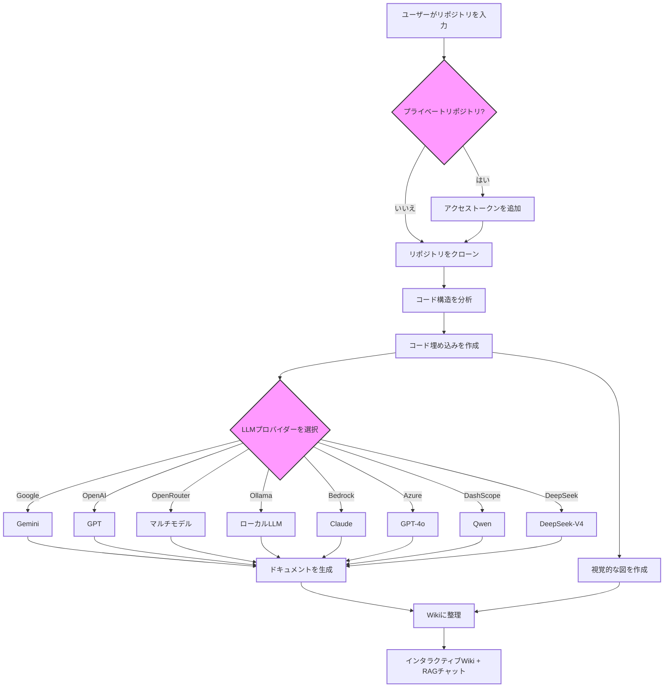

# DeepWiki-Open


**DeepWiki-Open**は、GitHub、GitLab、またはBitBucketリポジトリのための美しくインタラクティブなWikiを自動的に作成するオープンソースのAI搭載ツールです。リポジトリURLを入力するだけで、DeepWikiは以下を行います：

1. コード構造を分析
2. 包括的なドキュメントを生成
3. 視覚的な図（Mermaid）を作成して仕組みを説明
4. すべてを簡単に閲覧できるWikiに整理

[](https://buymeacoffee.com/sheing)
[](https://tip.md/sng-asyncfunc)
[](https://x.com/sashimikun_void)
[](https://discord.com/invite/VQMBGR8u5v)

[English](./README.md) | [简体中文](./README.zh.md) | [繁體中文](./README.zh-tw.md) | [日本語](./README.ja.md) | [Español](./README.es.md) | [한국어](./README.kr.md) | [Tiếng Việt](./README.vi.md) | [Português Brasileiro](./README.pt-br.md) | [Français](./README.fr.md) | [Русский](./README.ru.md)

## ✨ 特徴

- **即時ドキュメント生成**: あらゆるGitHub、GitLab、Bitbucketリポジトリを数分でWikiに変換
- **プライベートリポジトリ対応**: 個人アクセストークンを使用してプライベートリポジトリに安全にアクセス
- **AI搭載の分析**: LLMによるインテリジェントなコード構造と関係性の理解
- **美しい図表**: アーキテクチャとデータフローを視覚化する自動生成Mermaid図
- **質問モード**: RAG搭載AIでリポジトリとチャットし、正確でコンテキストに応じた回答を取得
- **詳細調査**: 複雑なトピックを徹底的に調査する最大5反復のマルチターン分析
- **8つのLLMプロバイダー**: Google Gemini、OpenAI、OpenRouter、Ollama（ローカル）、AWS Bedrock、Azure AI、DashScope（Alibaba）、DeepSeek
- **4つの埋め込みバックエンド**: OpenAI、Google、Ollama、AWS Bedrock埋め込み
- **10言語対応**: 英語、日本語、中国語、韓国語、スペイン語、ベトナム語、ポルトガル語、フランス語、ロシア語、繁体字中国語でドキュメント生成
- **WebSocketストリーミング**: WebSocketまたはHTTP SSEによるリアルタイムWikiチャット
- **エージェントループ**: DeepSeekとOpenAIモデル向け自律ツール呼び出し（コードベース検索、ファイル読み取り、リポジトリリスト）
- **包括/簡潔モード**: 完全な複数ページWikiまたは単一ページサマリー

## 🚀 クイックスタート

### 前提条件

最低限必要なもの：
- **Google APIキー**（Gemini用）または **OpenAI APIキー**、さらに埋め込み用の **OpenAI APIキー**
- または、**Ollama**で完全ローカル実行（生成にAPIキー不要、ただしOllama埋め込みを使用しない場合はOpenAI埋め込み用キーが必要）

### オプション1: Docker（推奨）

```bash
# リポジトリをクローン
git clone https://github.com/AsyncFuncAI/deepwiki-open.git
cd deepwiki-open

# APIキーを含む.envファイルを作成
cp .env.example .env  # または手動作成:
echo "GOOGLE_API_KEY=your_google_api_key" > .env
echo "OPENAI_API_KEY=your_openai_api_key" >> .env

# Docker Composeで実行
docker-compose up
```

ブラウザで [http://localhost:3000](http://localhost:3000) を開きます。

> **データ永続化**: Dockerは`~/.adalflow`をマウントし、クローンされたリポジトリ、埋め込み、Wikiキャッシュをコンテナ再起動後も保持します。

### オプション2: 手動セットアップ

#### ステップ1: APIキーの設定

プロジェクトルートに`.env`ファイルを作成：

```
# 必須
GOOGLE_API_KEY=your_google_api_key
OPENAI_API_KEY=your_openai_api_key

# オプション — 特定のプロバイダー使用時のみ必要
OPENROUTER_API_KEY=your_openrouter_api_key
AWS_ACCESS_KEY_ID=your_aws_access_key
AWS_SECRET_ACCESS_KEY=your_aws_secret_key
AWS_REGION=us-east-1
OLLAMA_HOST=http://localhost:11434

# サーバー設定
PORT=8001
SERVER_BASE_URL=http://localhost:8001
```

#### ステップ2: バックエンドの起動

```bash
# Python依存関係をインストールして仮想環境を同期
uv sync

# APIサーバーを起動
uv run python -m api.main
```

APIは`http://localhost:8001`で実行されます。

#### ステップ3: フロントエンドの起動

```bash
# JavaScript依存関係をインストール
yarn install

# Next.js開発サーバーを起動
yarn dev
```

[http://localhost:3000](http://localhost:3000) を開き、GitHub、GitLab、BitbucketのリポジトリURLを入力します。

### オプション3: LiteLLMプロキシ

複数のLLMプロバイダーを統合プロキシとしてLiteLLMを使用：

```bash
docker-compose -f docker-compose-litellm.yml up
```

## 🔍 仕組み



## 🛠️ プロジェクト構造

```
deepwiki-open/
├── api/                          # Python FastAPIバックエンド
│   ├── main.py                   # エントリーポイント（uvicornサーバー）
│   ├── api.py                    # REST APIエンドポイント
│   ├── simple_chat.py            # HTTP SSEストリーミングチャット
│   ├── websocket_wiki.py         # WebSocketチャット + 詳細調査
│   ├── agent_loop.py             # 自律ツール呼び出しエージェント
│   ├── rag.py                    # RAG: FAISS検索 + LLM生成
│   ├── data_pipeline.py          # リポジトリクローン、埋め込みパイプライン
│   ├── prompts.py                # LLMプロンプトテンプレート
│   ├── config.py                 # 設定ローダー
│   ├── config/                   # JSON設定ファイル
│   │   ├── generator.json        # LLMプロバイダー/モデル定義
│   │   ├── embedder.json         # 埋め込みモデル設定
│   │   ├── lang.json             # 対応言語
│   │   └── repo.json             # ファイルフィルタールール
│   └── tools/
│       ├── agent_tools.py        # エージェントツール（検索、読み取り、リスト）
│       └── embedder.py           # 埋め込みファクトリー
├── src/                          # Next.jsフロントエンド
│   ├── app/
│   │   ├── page.tsx              # ホームページ（URL入力、設定）
│   │   └── [owner]/[repo]/       # Wikiビューア（動的ルート）
│   ├── components/               # Reactコンポーネント
│   │   ├── Ask.tsx               # チャット入力
│   │   ├── Markdown.tsx          # Markdownレンダラー
│   │   ├── Mermaid.tsx           # 図表レンダラー
│   │   ├── WikiTreeView.tsx      # Wikiページナビゲーション
│   │   └── ConfigurationModal.tsx # 生成前設定
│   ├── messages/                 # i18n翻訳（10言語）
│   └── utils/
│       └── websocketClient.ts    # WebSocketクライアント
├── tests/                        # テストスイート（ユニット、統合、API）
├── pyproject.toml                # Pythonプロジェクト設定（uv）
├── uv.lock                       # ロックされたPython依存関係
├── Dockerfile                    # マルチステージビルド（Node + Python）
├── docker-compose.yml            # 本番用Docker Compose
└── next.config.ts                # APIリライト設定付きNext.js設定
```

## 🤖 質問と詳細調査

### 質問モード

RAG（Retrieval Augmented Generation）を使用してリポジトリとチャット：

- **コンテキスト対応**: リポジトリの実際のコードに基づいた回答
- **リアルタイムストリーミング**: SSEまたはWebSocketで生成される回答をライブ表示
- **会話履歴**: 複数の質問間でコンテキストを維持

### 詳細調査機能

詳細調査は複雑な質問に対してマルチターン分析（最大5反復）を実行します：

1. **研究計画**（反復1）: アプローチと初期調査結果の概要
2. **詳細分析**（反復2〜4）: 各ラウンドで前回の洞察を発展
3. **最終結論**（反復5）: すべての調査結果を統合した包括的な回答

チャットインターフェースで質問を送信する前に「詳細調査」をオンに切り替えます。

## ⚙️ 設定

### LLMプロバイダー

`api/config/generator.json`で設定可能な**8つのLLMプロバイダー**に対応：

| プロバイダー | デフォルトモデル | 特徴 | 必要なAPIキー |
|---|---|---|---|
| Google | `gemini-2.5-flash` | 高速、コスト効率良好 | `GOOGLE_API_KEY` |
| OpenAI | `gpt-5.4-mini` | 思考/推論機能 | `OPENAI_API_KEY` |
| OpenRouter | `openai/gpt-5-nano` | マルチモデルプロキシ | `OPENROUTER_API_KEY` |
| Ollama | `qwen3:1.7b` | ローカル実行、APIキー不要 | なし |
| AWS Bedrock | `claude-sonnet-4-6` | 適応型思考 | `AWS_ACCESS_KEY_ID` + `AWS_SECRET_ACCESS_KEY` |
| Azure AI | `gpt-4o` | エンタープライズAzure | Azure認証情報 |
| DashScope | `qwen-plus` | Alibaba Qwenモデル | DashScope APIキー |
| DeepSeek | `deepseek-v4-flash` | 思考 + ツール呼び出し | DeepSeek APIキー |

### 埋め込みバックエンド

`DEEPWIKI_EMBEDDER_TYPE`環境変数で制御：

| バックエンド | モデル | 次元数 | バッチサイズ |
|---|---|---|---|
| `openai`（デフォルト） | `text-embedding-3-small` | 256 | 500 |
| `google` | `gemini-embedding-001` | 768 | 100 |
| `ollama` | `nomic-embed-text` | 768 | 単一ドキュメント |
| `bedrock` | `titan-embed-text-v2` | 256 | 100 |

### 環境変数

| 変数 | 必須 | 説明 |
|---|---|---|
| `GOOGLE_API_KEY` | 要* | Google Gemini APIキー |
| `OPENAI_API_KEY` | 要* | OpenAI APIキー（埋め込み + チャット） |
| `OPENROUTER_API_KEY` | 不要 | OpenRouter APIキー |
| `OPENAI_BASE_URL` | 不要 | カスタムOpenAI互換エンドポイント |
| `OLLAMA_HOST` | 不要 | OllamaサーバーURL（デフォルト: `http://localhost:11434`） |
| `AWS_ACCESS_KEY_ID` | 不要 | AWS Bedrockアクセスキー |
| `AWS_SECRET_ACCESS_KEY` | 不要 | AWS Bedrockシークレットキー |
| `AWS_REGION` | 不要 | AWSリージョン（デフォルト: `us-east-1`） |
| `DEEPWIKI_EMBEDDER_TYPE` | 不要 | 埋め込みバックエンド: `openai`、`google`、`ollama`、`bedrock` |
| `DEEPWIKI_CONFIG_DIR` | 不要 | カスタム設定ディレクトリパス |
| `DEEPWIKI_AUTH_MODE` | 不要 | 認証要求を有効化（`true`/`1`） |
| `DEEPWIKI_AUTH_CODE` | 不要 | 認証モード有効時の認証コード |
| `PORT` | 不要 | APIサーバーポート（デフォルト: `8001`） |
| `SERVER_BASE_URL` | 不要 | フロントエンドプロキシ用バックエンドURL（デフォルト: `http://localhost:8001`） |

\* 生成には`GOOGLE_API_KEY`または`OPENAI_API_KEY`のいずれかが必要。代替埋め込みを使用しない限り、`OPENAI_API_KEY`は埋め込みにも必要です。

### JSON設定ファイル

`api/config/`に配置（`DEEPWIKI_CONFIG_DIR`でカスタマイズ可能）：

1. **`generator.json`** — LLMプロバイダー/モデル定義、機能、デフォルト値
2. **`embedder.json`** — 埋め込みモデル、検索設定（`top_k: 20`）、テキスト分割設定（`chunk_size: 350`、`chunk_overlap: 100`）
3. **`repo.json`** — ファイルフィルター（除外ディレクトリ、ファイルパターン）とサイズ制限
4. **`lang.json`** — 対応出力言語と表示名

## 🔐 認証モード

フロントエンドからのWiki生成を制限するには：

```
DEEPWIKI_AUTH_MODE=true
DEEPWIKI_AUTH_CODE=your_secret_code
```

有効にすると、ユーザーはWikiを生成するために認証コードの入力が必要です。注意：これはフロントエンドUIとキャッシュされたWikiの削除を保護しますが、APIへの直接アクセスは防止しません。

## 🐳 Dockerセットアップ

### 事前ビルドイメージの使用

```bash
# GitHub Container Registryからイメージをプル
docker pull ghcr.io/asyncfuncai/deepwiki-open:latest

# 環境変数を設定してコンテナを実行
docker run -p 8001:8001 -p 3000:3000 \
  -e GOOGLE_API_KEY=your_google_api_key \
  -e OPENAI_API_KEY=your_openai_api_key \
  -v ~/.adalflow:/root/.adalflow \
  ghcr.io/asyncfuncai/deepwiki-open:latest
```

### .envファイルをマウント

```bash
docker run -p 8001:8001 -p 3000:3000 \
  -v $(pwd)/.env:/app/.env \
  -v ~/.adalflow:/root/.adalflow \
  ghcr.io/asyncfuncai/deepwiki-open:latest
```

### ローカルビルド

```bash
git clone https://github.com/AsyncFuncAI/deepwiki-open.git
cd deepwiki-open

docker build -t deepwiki-open .

docker run -p 8001:8001 -p 3000:3000 \
  -e GOOGLE_API_KEY=your_google_api_key \
  -e OPENAI_API_KEY=your_openai_api_key \
  -v ~/.adalflow:/root/.adalflow \
  deepwiki-open
```

データ永続化のため、`~/.adalflow`は以下のデータを保存します：
- クローンされたリポジトリ (`~/.adalflow/repos/`)
- 埋め込みとインデックス (`~/.adalflow/databases/`)
- 生成されたWikiキャッシュ (`~/.adalflow/wikicache/`)

## 📱 スクリーンショット


*DeepWikiのメインインターフェース*


*個人アクセストークンを使用したプライベートリポジトリへのアクセス*


*詳細調査は複雑なトピックに対して多段階の調査を実施*

### デモビデオ

[](https://youtu.be/zGANs8US8B4)

*DeepWikiの動作を見る！*

## ❓ トラブルシューティング

### APIキーの問題
- **「環境変数が見つかりません」**: `.env`ファイルがプロジェクトルートに存在し、必要なAPIキーが含まれていることを確認
- **「APIキーが無効です」**: キーが余分なスペースや改行なしで正しくコピーされていることを確認
- **「プロバイダーAPIエラー」**: APIキーに十分なクォータ/クレジットがあることを確認

### 接続の問題
- **「APIサーバーに接続できません」**: バックエンドがポート8001で実行されていることを確認
- **「CORSエラー」**: フロントエンドとバックエンドを同じマシンで実行するか、`SERVER_BASE_URL`を設定
- **WebSocketが失敗する**: プロキシがWebSocket接続をブロックしていないか確認

### 生成の問題
- **「Wiki生成中にエラー」**: まず小さなリポジトリで試してください。大規模リポジトリはタイムアウトする場合があります
- **「無効なリポジトリ形式」**: 有効なGitHub/GitLab/Bitbucket URL形式を使用していることを確認
- **「リポジトリ構造を取得できません」**: プライベートリポジトリの場合、アクセストークンに正しい権限があることを確認
- **「図表レンダリングエラー」**: アプリが壊れたMermaid図を自動的に修正しようとします

### 一般的な解決策
1. フロントエンドとバックエンドの両方のサーバーを再起動
2. ブラウザのコンソール（F12）でJavaScriptエラーを確認
3. APIターミナルの出力でPythonエラーを確認
4. ブラウザキャッシュまたはUIからWikiキャッシュをクリア

## 🤝 貢献

貢献を歓迎します！以下のことを自由に行ってください：
- バグや機能リクエストのIssueを作成
- コード改善のプルリクエストを送信
- フィードバックやアイデアを共有

## 📄 ライセンス

このプロジェクトはMITライセンスの下でライセンスされています — 詳細は[LICENSE](LICENSE)ファイルを参照してください。

## ⭐ スター履歴

[](https://star-history.com/#AsyncFuncAI/deepwiki-open&Date)
