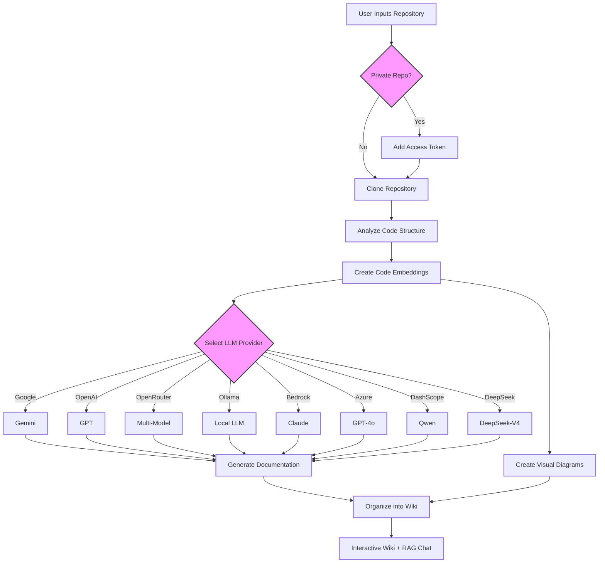

# DeepWiki-Open


**DeepWiki-Open** is an open-source, AI-powered tool that automatically creates beautiful, interactive wikis for any GitHub, GitLab, or BitBucket repository. Just enter a repo URL, and DeepWiki will:

1. Analyze the code structure
2. Generate comprehensive documentation
3. Create visual diagrams (Mermaid) to explain how everything works
4. Organize it all into an easy-to-navigate wiki

[](https://buymeacoffee.com/sheing)
[](https://tip.md/sng-asyncfunc)
[](https://x.com/sashimikun_void)
[](https://discord.com/invite/VQMBGR8u5v)

[English](./README.md) | [简体中文](./README.zh.md) | [繁體中文](./README.zh-tw.md) | [日本語](./README.ja.md) | [Español](./README.es.md) | [한국어](./README.kr.md) | [Tiếng Việt](./README.vi.md) | [Português Brasileiro](./README.pt-br.md) | [Français](./README.fr.md) | [Русский](./README.ru.md)

## Features

- **Instant Documentation**: Turn any GitHub, GitLab, or BitBucket repository into a wiki in minutes
- **Private Repository Support**: Securely access private repos using personal access tokens
- **AI-Powered Analysis**: Intelligent code structure and relationship understanding via LLMs
- **Beautiful Diagrams**: Auto-generated Mermaid diagrams visualizing architecture and data flow
- **Ask Mode**: Chat with your repository using RAG-powered AI for accurate, context-aware answers
- **Deep Research**: Multi-turn (up to 5 iterations) analysis for thorough investigation of complex topics
- **8 LLM Providers**: Google Gemini, OpenAI, OpenRouter, Ollama (local), AWS Bedrock, Azure AI, DashScope (Alibaba), and DeepSeek
- **4 Embedding Backends**: OpenAI, Google, Ollama, and AWS Bedrock embeddings
- **10 Languages**: Generate documentation in English, Japanese, Chinese, Korean, Spanish, Vietnamese, Portuguese, French, Russian, and Traditional Chinese
- **WebSocket Streaming**: Real-time chat with the wiki via WebSocket or HTTP SSE
- **Agent Loop**: Autonomous tool-calling for DeepSeek and OpenAI models (search, read files, list repo)
- **Comprehensive & Concise Modes**: Full multi-page wiki or single-page summary

## Quick Start

### Prerequisites

You need at minimum:
- A **Google API key** (for Gemini) or **OpenAI API key**, plus an **OpenAI API key** for embeddings
- Alternatively, run entirely locally with **Ollama** (no API keys needed for generation, but still need OpenAI for embeddings unless using Ollama embeddings)

### Option 1: Docker (Recommended)

```bash
# Clone the repository
git clone https://github.com/AsyncFuncAI/deepwiki-open.git
cd deepwiki-open

# Create a .env file with your API keys
cp .env.example .env  # Or create manually:
echo "GOOGLE_API_KEY=your_google_api_key" > .env
echo "OPENAI_API_KEY=your_openai_api_key" >> .env

# Run with Docker Compose
docker-compose up
```

Open [http://localhost:3000](http://localhost:3000) in your browser.

> **Data Persistence**: Docker mounts `~/.adalflow` to persist cloned repos, embeddings, and wiki cache across container restarts.

### Option 2: Manual Setup

#### Step 1: Configure API Keys

Create a `.env` file in the project root:

```
# Required
GOOGLE_API_KEY=your_google_api_key
OPENAI_API_KEY=your_openai_api_key

# Optional — only needed for specific providers
OPENROUTER_API_KEY=your_openrouter_api_key
AWS_ACCESS_KEY_ID=your_aws_access_key
AWS_SECRET_ACCESS_KEY=your_aws_secret_key
AWS_REGION=us-east-1
OLLAMA_HOST=http://localhost:11434

# Server config
PORT=8001
SERVER_BASE_URL=http://localhost:8001
```

#### Step 2: Start the Backend

```bash
# Install Python dependencies and sync virtual env
uv sync

# Start the API server
uv run python -m api.main
```

The API runs on `http://localhost:8001`.

#### Step 3: Start the Frontend

```bash
# Using pnpm (recommended)
pnpm install
pnpm dev

# Or using yarn
yarn install
yarn dev

# Or using npm
npm install
npm run dev
```

Open [http://localhost:3000](http://localhost:3000) and enter any GitHub, GitLab, or BitBucket repository URL.

### Option 3: LiteLLM Proxy

Use LiteLLM as a unified proxy for multiple LLM providers:

```bash
docker-compose -f docker-compose-litellm.yml up
```

## How It Works



## Project Structure

```
deepwiki-open/
├── api/                          # Python FastAPI backend
│   ├── main.py                   # Entry point (uvicorn server)
│   ├── api.py                    # REST API endpoints
│   ├── simple_chat.py            # HTTP SSE streaming chat
│   ├── websocket_wiki.py         # WebSocket chat + Deep Research
│   ├── agent_loop.py             # Autonomous tool-calling agent
│   ├── rag.py                    # RAG: FAISS retriever + LLM generator
│   ├── data_pipeline.py          # Repo cloning, embedding pipeline
│   ├── prompts.py                # LLM prompt templates
│   ├── config.py                 # Configuration loader
│   ├── config/                   # JSON configuration
│   │   ├── generator.json        # LLM provider/model definitions
│   │   ├── embedder.json         # Embedding model config
│   │   ├── lang.json             # Supported languages
│   │   └── repo.json             # File filter rules
│   └── tools/
│       ├── agent_tools.py        # Agent tools (search, read, list)
│       └── embedder.py           # Embedder factory
├── src/                          # Next.js frontend
│   ├── app/
│   │   ├── page.tsx              # Home page (URL input, config)
│   │   └── [owner]/[repo]/       # Wiki viewer (dynamic route)
│   ├── components/               # React components
│   │   ├── Ask.tsx               # Chat input
│   │   ├── Markdown.tsx          # Markdown renderer
│   │   ├── Mermaid.tsx           # Diagram renderer
│   │   ├── WikiTreeView.tsx      # Wiki page navigation
│   │   └── ConfigurationModal.tsx # Pre-generation config
│   ├── messages/                 # i18n translations (10 languages)
│   └── utils/
│       └── websocketClient.ts    # WebSocket client
├── tests/                        # Test suite (unit, integration, API)
├── pyproject.toml                # Python project config (uv)
├── uv.lock                       # Locked Python dependencies
├── Dockerfile                    # Multi-stage build (Node + Python)
├── docker-compose.yml            # Production Docker Compose
└── next.config.ts                # Next.js config with API rewrites
```

## Ask & Deep Research

### Ask Mode

Chat with your repository using RAG (Retrieval Augmented Generation):

- **Context-aware**: Responses grounded in actual repository code
- **Real-time streaming**: See answers generated live via SSE or WebSocket
- **Conversation history**: Maintains context across multiple questions

### Deep Research

Deep Research performs multi-turn analysis (up to 5 iterations) for complex questions:

1. **Research Plan** (iteration 1): Outlines approach and initial findings
2. **Deep Dive** (iterations 2-4): Each round builds on previous insights
3. **Final Conclusion** (iteration 5): Comprehensive answer synthesizing all findings

Toggle "Deep Research" in the chat interface before submitting your question.

## Configuration

### LLM Providers

DeepWiki supports **8 LLM providers**, configurable via `api/config/generator.json`:

| Provider | Default Model | Features | API Key Required |
|---|---|---|---|
| Google | `gemini-2.5-flash` | Fast, cost-effective | `GOOGLE_API_KEY` |
| OpenAI | `gpt-5.4-mini` | Thinking/reasoning | `OPENAI_API_KEY` |
| OpenRouter | `openai/gpt-5-nano` | Multi-model proxy | `OPENROUTER_API_KEY` |
| Ollama | `qwen3:1.7b` | Local, no API key | None |
| AWS Bedrock | `claude-sonnet-4-6` | Adaptive thinking | `AWS_ACCESS_KEY_ID` + `AWS_SECRET_ACCESS_KEY` |
| Azure AI | `gpt-4o` | Enterprise Azure | Azure credentials |
| DashScope | `qwen-plus` | Alibaba Qwen models | DashScope API key |
| DeepSeek | `deepseek-v4-flash` | Thinking + tool calling | DeepSeek API key |

### Embedding Backends

Controlled via `DEEPWIKI_EMBEDDER_TYPE` environment variable:

| Backend | Model | Dimensions | Batch Size |
|---|---|---|---|
| `openai` (default) | `text-embedding-3-small` | 256 | 500 |
| `google` | `gemini-embedding-001` | 768 | 100 |
| `ollama` | `nomic-embed-text` | 768 | Single-doc |
| `bedrock` | `titan-embed-text-v2` | 256 | 100 |

### Environment Variables

| Variable | Required | Description |
|---|---|---|
| `GOOGLE_API_KEY` | Yes* | Google Gemini API key |
| `OPENAI_API_KEY` | Yes* | OpenAI API key (embeddings + chat) |
| `OPENROUTER_API_KEY` | No | OpenRouter API key |
| `OPENAI_BASE_URL` | No | Custom OpenAI-compatible endpoint |
| `OLLAMA_HOST` | No | Ollama server URL (default: `http://localhost:11434`) |
| `AWS_ACCESS_KEY_ID` | No | AWS Bedrock access key |
| `AWS_SECRET_ACCESS_KEY` | No | AWS Bedrock secret key |
| `AWS_REGION` | No | AWS region (default: `us-east-1`) |
| `DEEPWIKI_EMBEDDER_TYPE` | No | Embedding backend: `openai`, `google`, `ollama`, `bedrock` |
| `DEEPWIKI_CONFIG_DIR` | No | Custom config directory path |
| `DEEPWIKI_AUTH_MODE` | No | Enable auth requirement (`true`/`1`) |
| `DEEPWIKI_AUTH_CODE` | No | Required auth code when auth mode is enabled |
| `PORT` | No | API server port (default: `8001`) |
| `SERVER_BASE_URL` | No | Backend URL for frontend proxy (default: `http://localhost:8001`) |

\* Either `GOOGLE_API_KEY` or `OPENAI_API_KEY` is required for generation; `OPENAI_API_KEY` is also needed for embeddings unless using an alternative embedder.

### JSON Configuration Files

Located in `api/config/` (customizable via `DEEPWIKI_CONFIG_DIR`):

1. **`generator.json`** — LLM provider/model definitions, features, defaults
2. **`embedder.json`** — Embedding model, retriever (`top_k: 20`), text splitter (`chunk_size: 350`, `chunk_overlap: 100`)
3. **`repo.json`** — File filters (excluded directories, file patterns) and size limits
4. **`lang.json`** — Supported output languages and their display names

## Authentication Mode

Enable to restrict wiki generation via the frontend:

```
DEEPWIKI_AUTH_MODE=true
DEEPWIKI_AUTH_CODE=your_secret_code
```

When enabled, users must enter the auth code to generate wikis. Note: this protects the frontend UI and cached wiki deletion, but does not prevent direct API access.

## Troubleshooting

### API Key Issues
- **"Missing environment variables"**: Ensure `.env` exists in the project root with required keys
- **"Invalid API key"**: Verify keys are copied correctly without extra spaces or newlines
- **"Provider API error"**: Check your API key has sufficient quota/credits

### Connection Issues
- **"Cannot connect to API server"**: Ensure the backend is running on port 8001
- **"CORS error"**: Run frontend and backend on the same machine, or configure `SERVER_BASE_URL`
- **WebSocket fails**: Check that no proxy is blocking WebSocket connections

### Generation Issues
- **"Error generating wiki"**: Try a smaller repository first; very large repos may time out
- **"Invalid repository format"**: Use a valid GitHub/GitLab/Bitbucket URL
- **"Cannot fetch repo structure"**: For private repos, verify your access token has correct permissions
- **"Diagram rendering error"**: The app automatically attempts to fix broken Mermaid diagrams

### Common Fixes
1. Restart both frontend and backend servers
2. Check browser console (F12) for JavaScript errors
3. Check API terminal output for Python errors
4. Clear browser cache or wiki cache via the UI

## Contributing

Contributions are welcome! Feel free to:
- Open issues for bugs or feature requests
- Submit pull requests to improve the code
- Share your feedback and ideas

## License

This project is licensed under the MIT License - see the [LICENSE](LICENSE) file for details.

## Star History

[](https://star-history.com/#AsyncFuncAI/deepwiki-open&Date)
